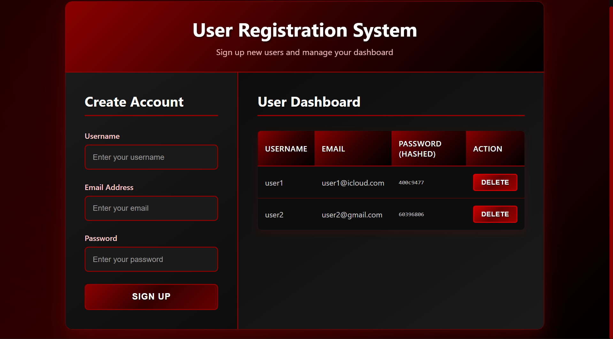
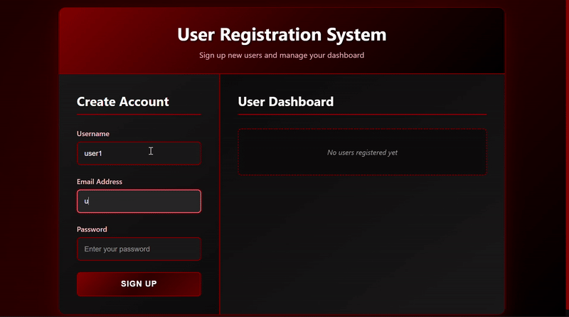
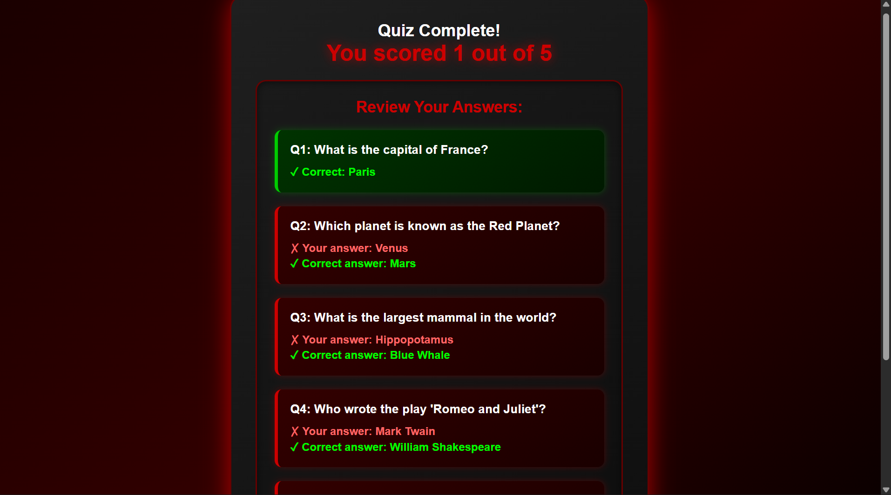
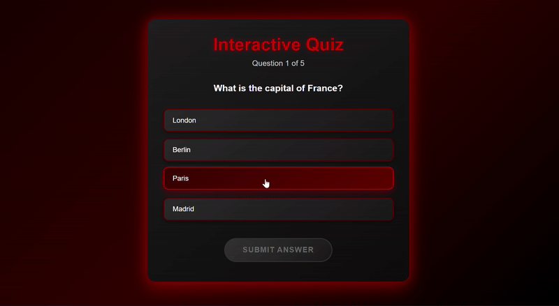

# Technical Domain Tasks

This repository contains my submissions for the NSCC Technical Domain Task.  
Each task is organized in its own folder with code, README, screenshots, and demo GIFs.  

---

## Task 1: Signup Form + Dashboard
- Dark mode signup form with validation  
- Redirects to a dashboard page  

 [Click here to view the live page](https://aditya-git-07.github.io/NSCC-TECHDOMAIN-TASK/task1/dark-signup-dashboard.html)

### Screenshot

### Demo GIF

---

## Task 2: Interactive Quiz App
- Dark theme multiple-choice quiz app  
- Shows score after completion  

 [Click here to view the live page](https://aditya-git-07.github.io/NSCC-TECHDOMAIN-TASK/task2/dark-red-quiz-app.html)

 ### Screenshot

### Demo Video

---

